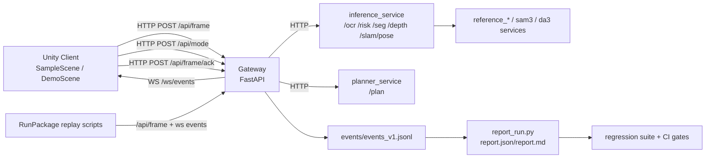

# Project Be Your Eyes

[Chinese Docs](docs/Chinese/README.md)

Current development version: **see [VERSION](VERSION)**.

Be Your Eyes is a Unity + Gateway assistive perception stack for visually impaired navigation/readability workflows. Current capability scope includes:

- `risk` (hazard/risk events)
- `ocr` (text reading)
- `seg` (segmentation context)
- `depth` (depth estimation + risk-related metrics)
- `slam` (pose/tracking context)
- `plan` (action planning + confirm loop)

## 1) Architecture



## 2) Quick Start A: Offline Evaluation (10-minute path)

### Prerequisites

```bash
python -m pip install --upgrade pip
python -m pip install -r Gateway/requirements.txt
```

### CI-equivalent checks

```bash
cd Gateway
python -m pytest -q -n auto --dist loadgroup
cd ..
python Gateway/scripts/lint_run_package.py --run-package Gateway/tests/fixtures/run_package_with_events_v1_min
python Gateway/scripts/run_regression_suite.py --suite Gateway/regression/suites/baseline_suite.json --baseline Gateway/regression/baselines/baseline.json --fail-on-drop --fail-on-critical-fn
python Gateway/scripts/run_regression_suite.py --suite Gateway/regression/suites/contract_suite.json --baseline Gateway/regression/baselines/baseline.json --fail-on-drop --fail-on-critical-fn
python Gateway/scripts/verify_contracts.py --check-lock
python tools/check_unity_meta.py
python tools/check_docs_links.py
```

### Replay + report

```bash
python Gateway/scripts/replay_run_package.py --run-package Gateway/tests/fixtures/run_package_with_risk_gt_min --reset
python Gateway/scripts/report_run.py --run-package Gateway/tests/fixtures/run_package_with_risk_gt_min
```

If Gateway auth is enabled, add replay key:

```bash
python Gateway/scripts/replay_run_package.py --run-package Gateway/tests/fixtures/run_package_with_risk_gt_min --reset --gateway-api-key YOUR_KEY_HERE
```

### Success signals

- `events/events_v1.jsonl` is generated/updated.
- `report.json` and `report.md` exist in the run package directory.
- Regression exits 0 and does not hit critical-fn gate.

## 3) Quick Start B: Unity + Gateway Realtime (30-minute path)

Quest 3 specific steps are documented in [docs/maintainer/RUNBOOK_QUEST3.md](docs/maintainer/RUNBOOK_QUEST3.md), including Live Loop controls and recommended capture defaults.

### Start backend processes

Optional one-command local orchestration:

```bash
python Gateway/scripts/dev_up.py --gateway-only
python Gateway/scripts/dev_up.py --with-inference
```

Quest 3 smoke one-command launcher (Windows):

```powershell
powershell -ExecutionPolicy Bypass -File tools/quest3/quest3_smoke.ps1 --usb
```

Quest 3 v5.03 real-stack launcher (USB + gateway + inference providers + assist/find/track/record):

```bat
tools\quest3\quest3_usb_realstack_v5_03.cmd
```

Optional online pySLAM bridge in the same launcher:
```bat
set BYES_ENABLE_PYSLAM_SERVICE=1
tools\quest3\quest3_usb_realstack_v5_03.cmd
```

Optional hardened profile smoke (still local bind unless you override host):

```bash
# PowerShell
$env:BYES_GATEWAY_PROFILE="hardened"
python Gateway/scripts/dev_up.py --gateway-only
```

Manual split terminals:

Terminal 1 (Gateway):

```bash
python -m uvicorn main:app --app-dir Gateway --host 127.0.0.1 --port 8000
```

Terminal 2 (optional inference service):

```bash
python -m uvicorn services.inference_service.app:app --app-dir Gateway --host 127.0.0.1 --port 19120
```

### Start Unity

- Open this repo in Unity `6000.3.5f2`.
- Default enabled scene is `Assets/Scenes/SampleScene.unity`.
- Demo alternative: `Assets/Scenes/DemoScene.unity`.
- Default WS URL in scene/client: `ws://127.0.0.1:8000/ws/events`.

### Runtime controls

- Trigger scan/upload: `S`
- Toggle live loop: `L` (Quest controller primary button/A in `Quest3SmokeScene`)
- Quest manual scan: right-hand trigger (desktop fallback remains `S`)
- Mode switch: `1/2/3` or `F1/F2/F3`
- Confirm decision: `Y/N` (or XR primary/secondary)
- Connection panel probes: `Test Ping`, `Read Mode`, `Get Version`
- `Quest3SmokeScene` runs zero-controller self-test on startup (ping/version/mode/live-loop) and reports `RUNNING/PASS/FAIL` in panel
- v5.00 Quest default entry: palm-up + pinch opens official hand menu (`Connection / Actions / Mode / Panels / Settings / Debug`)
- v5.01 actions in hand menu include `Read Text Once` and `Detect Once`, and panel shows `Last OCR / Last DET / Last RISK` with age.
- v5.02 adds promptable `Find` actions (Door/Exit/Stairs/Elevator/Restroom/Person), `Start Record/Stop Record`, and panel lines for `Last FIND` and `Guidance`.
- v5.03 adds `Select ROI / Start Track / Track Step / Stop Track`, `Last TARGET`, and optional guidance audio/haptics cues.
- Gesture shortcuts default to `Safe` mode (no trigger while menu/system gesture/UI/grab conflict is active)
- Smoke panel move/resize is now explicit opt-in from hand menu (`Panels -> Enable Move/Resize`)
- Passthrough can be toggled from hand menu (`Settings -> Passthrough`)

### Success signals

- Gateway receives `/api/frame` requests.
- Gateway receives `/api/mode` when mode hotkeys switch mode.
- Gateway `/api/version` returns runtime version/build metadata for panel diagnostics.
- Unity receives `/ws/events` messages.
- `/api/frame/ack` is posted after UI/audio/haptic feedback.

## 4) Configuration (minimal set)

See [.env.example](.env.example) for a minimal configuration checklist (placeholders only).

Typical local baseline:

- `BYES_OCR_BACKEND=mock`
- `BYES_RISK_BACKEND=mock`
- `BYES_SEG_BACKEND=mock`
- `BYES_DEPTH_BACKEND=mock`
- `BYES_DET_BACKEND=mock`
- `BYES_SLAM_BACKEND=mock`
- `GATEWAY_SEND_ENVELOPE=false`
- `BYES_INFERENCE_EMIT_WS_V1=false`
- `BYES_PLANNER_PROVIDER=reference`

Planner/LLM keys (if using llm provider):

- Primary: `BYES_PLANNER_LLM_API_KEY=YOUR_KEY_HERE`
- Compatibility fallback: `OPENAI_API_KEY=YOUR_KEY_HERE`

Gateway guardrails (optional):

- `BYES_GATEWAY_API_KEY=YOUR_KEY_HERE` (enables API key checks for HTTP+WS)
- `BYES_GATEWAY_ALLOWED_HOSTS=localhost,127.0.0.1` (optional host allowlist)
- `BYES_GATEWAY_ALLOWED_ORIGINS=https://example.com` (optional origin allowlist)
- `BYES_GATEWAY_PROFILE=local|hardened` (`local` default; `hardened` enables safer defaults)
- `BYES_GATEWAY_DEV_ENDPOINTS_ENABLED=0/1` (default local `1`, hardened default `0`)
- `BYES_GATEWAY_RUNPACKAGE_UPLOAD_ENABLED=0/1` (default local `1`, hardened default `0`)
- `BYES_GATEWAY_ALLOW_LOCAL_RUNPACKAGE_PATH=0/1` (default local `1`, hardened default `0`)
- `BYES_GATEWAY_MAX_FRAME_BYTES`, `BYES_GATEWAY_MAX_RUNPACKAGE_ZIP_BYTES`, `BYES_GATEWAY_MAX_JSON_BYTES` (request body limits)
- `BYES_GATEWAY_RATE_LIMIT_ENABLED`, `BYES_GATEWAY_RATE_LIMIT_RPS`, `BYES_GATEWAY_RATE_LIMIT_BURST`, `BYES_GATEWAY_RATE_LIMIT_KEY_MODE`
- `BYES_MODE_PROFILE_JSON` (optional per-mode per-target stride profile; empty keeps legacy behavior)
- `BYES_EMIT_MODE_PROFILE_DEBUG=0/1` (emit `mode.profile` debug events for stride verification)
- `BYES_VERSION_OVERRIDE` (optional version string override for `/api/version`)
- `BYES_GIT_SHA` (optional build sha exposed by `/api/version`)

Optional real providers for v5.02:

- OCR (PaddleOCR): `python -m pip install -r Gateway/services/inference_service/requirements-paddleocr.txt`
- DET (Ultralytics): `python -m pip install -r Gateway/services/inference_service/requirements-ultralytics.txt`
- Depth ONNX: `python -m pip install -r Gateway/services/inference_service/requirements-onnx-depth.txt`
- If real provider dependencies/model files are missing, service endpoints return `503` with explicit guidance and the stack can still run with mock/reference backends.
- New in v5.02:
  - `POST /api/assist` reuses cached latest frame for per-action inference (`ocr/det/find/risk/depth/seg`) without requiring a fresh upload.
  - `POST /api/record/start` and `POST /api/record/stop` create Quest recording run-packages under `Gateway/runs/quest_recordings/`.
- New in v5.03:
  - `POST /api/assist` supports target session actions: `target_start`, `target_step`, `target_stop` (ROI + session id + tracker options).
  - Target session events are emitted on WS v1: `target.session` and `target.update`.
  - Optional offline pySLAM helper: `python Gateway/scripts/pyslam_run_package.py --run-package <path>`.

## 5) Data & Evaluation Flow

The core evaluation chain is:

`RunPackage -> events/events_v1.jsonl -> report.json -> regression gate`

Entry scripts:

- `Gateway/scripts/replay_run_package.py`
- `Gateway/scripts/report_run.py`
- `Gateway/scripts/run_regression_suite.py`

## 6) API & Contracts

- Gateway API inventory: [docs/maintainer/API_INVENTORY.md](docs/maintainer/API_INVENTORY.md)
- Contracts directory: `Gateway/contracts/`
- Schemas directory: `schemas/`
- Event schema notes: [docs/event_schema_v1.md](docs/event_schema_v1.md)

## 7) Security Statement

This repo's default dev setup is still localhost-first and intended for trusted network use.

- Optional built-in guardrail: set `BYES_GATEWAY_API_KEY` to require `X-BYES-API-Key` for HTTP and `api_key` on `/ws/events`.
- Optional host/origin checks: `BYES_GATEWAY_ALLOWED_HOSTS`, `BYES_GATEWAY_ALLOWED_ORIGINS`.
- Optional hardening profile: `BYES_GATEWAY_PROFILE=hardened` to default-disable dev/upload/local-path surfaces and enable rate/body-size limits.

- Do not expose Gateway/services directly to the internet without reverse-proxy auth + TLS.
- Treat upload/dev endpoints as non-public by default.

See [docs/maintainer/SECURITY_REVIEW.md](docs/maintainer/SECURITY_REVIEW.md) for the full security baseline.

## 8) Roadmap (open decisions)

See [docs/maintainer/OPEN_QUESTIONS.md](docs/maintainer/OPEN_QUESTIONS.md). Current key open items:

- ASR input roadmap (currently TTS-focused runtime)
- Deployment profile (local-only default vs hardened internet profile)
- Unity `.meta` governance policy
- Release tagging process tied to `VERSION`

## 9) Contributing / CI parity

Before opening PRs, run:

```bash
cd Gateway
python -m pytest -q -n auto --dist loadgroup
cd ..
python Gateway/scripts/lint_run_package.py --run-package Gateway/tests/fixtures/run_package_with_events_v1_min
python Gateway/scripts/run_regression_suite.py --suite Gateway/regression/suites/baseline_suite.json --baseline Gateway/regression/baselines/baseline.json --fail-on-drop --fail-on-critical-fn
python Gateway/scripts/run_regression_suite.py --suite Gateway/regression/suites/contract_suite.json --baseline Gateway/regression/baselines/baseline.json --fail-on-drop --fail-on-critical-fn
python Gateway/scripts/verify_contracts.py --check-lock
```

## 10) Maintainer Docs

- [docs/maintainer/REPO_FACTS.json](docs/maintainer/REPO_FACTS.json)
- [docs/maintainer/AUDIT_REPO.md](docs/maintainer/AUDIT_REPO.md)
- [docs/maintainer/RUNBOOK_LOCAL.md](docs/maintainer/RUNBOOK_LOCAL.md)
- [docs/maintainer/API_INVENTORY.md](docs/maintainer/API_INVENTORY.md)
- [docs/maintainer/CONFIG_MATRIX.md](docs/maintainer/CONFIG_MATRIX.md)
- [docs/maintainer/SECURITY_REVIEW.md](docs/maintainer/SECURITY_REVIEW.md)
- [docs/maintainer/OPEN_QUESTIONS.md](docs/maintainer/OPEN_QUESTIONS.md)
- [docs/maintainer/MAINTAINER_BRIEF.md](docs/maintainer/MAINTAINER_BRIEF.md)

## Release Tag Suggestion (manual, optional)

If maintainers decide to align release tags with `VERSION`:

```bash
git tag -a v5.03 -m "v5.03" <commit>
```

Do not run this automatically unless release approval is explicit.
