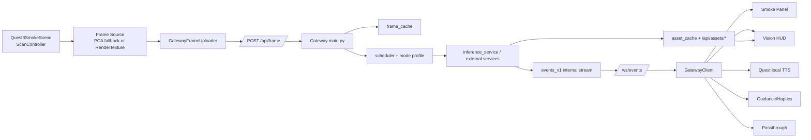
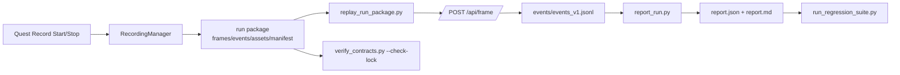

> Canonical maintainer memory.
> Source: reorganized from `docs/maintainer/ARCHITECTURE_REVIEW_v5.04.md`.
> Updated: `2026-03-07`.
> Companion files: `docs/maintainer/WORKFLOW_HANDOFF.md`, `docs/maintainer/REPO_FACTS.json`, `docs/maintainer/ACTIVE_PLAN.md`, `docs/maintainer/DECISIONS.md`.
> Historical snapshot: `docs/maintainer/archive/ARCHITECTURE_REVIEW_v5.04.md`.

# 1. Executive Summary

当前仓库已经不是“只有 Quest 面板参数演示”的状态，而是一个可跑通的 Quest 3 + PC Gateway + 可选推理服务的实时辅助感知烟测栈。

Quest 端已经具备：
- 真正的画面上传链路：`ScanController -> GatewayFrameUploader -> /api/frame`
- 真正的实时 HUD 可视输出：DET/SEG/DEPTH/target overlay 会通过 `/api/assets/*` 拉回资产并显示在 `ByesVisionHudController`
- 真正的 Quest 本地输出：Android TTS、passthrough 开关、基础 guidance 音频/触觉
- 真正的录制入口：`/api/record/start` / `/stop`

Gateway 端已经具备：
- 帧缓存、assist 二次推理、target tracking session、asset cache、recording manager、desktop console(`/ui`)
- `events_v1` 内部主链路与 run package/report/regression/contract gate 闭环
- 可切换的 real/mock provider 体系

但当前系统仍未完全产品化，主要短板是：
- Quest 端仍有大量状态型 UI，真实效果与状态信息混杂
- “real vs mock” 和 “legacy WS vs events_v1” 仍然需要靠环境变量与经验判断
- 所谓 `PCA` 帧源并不是真 Meta PCA，而是 `ARCameraManager` CPU image fallback
- `pySLAM realtime` 更像桥接脚手架；离线 run package runner 比实时链路更成熟
- UI 信息架构仍然拥挤，存在 hand menu / smoke panel / legacy wrist menu 多套入口并存

当前推荐职责划分：
- Quest 负责：采帧、手势/UI、HUD 叠加、passthrough、本地 TTS、音频/触觉反馈、录制触发、基础 ASR 录音上传
- PC 负责：OCR/DET/SEG/DEPTH/SLAM 等重计算、回放评测、回归门禁、桌面观测台、模型/权重管理
- Gateway 负责：统一 API、事件归一化、provider 编排、帧缓存/asset cache、recording/run package、contracts/gates

结论：当前分支已经适合作为 `v5.06+` 的“烟测主干”，但还不适合作为长期稳定架构基线；下一阶段应优先做职责边界清理、真实效果优先、real/mock 可观测化，而不是继续堆新按钮和新状态行。

# 2. Current Repository Architecture

## 2.1 Top-level Tree

```text
Project-Be-your-eyes/
|-- Assets/
|   |-- BeYourEyes/
|   |-- Editor/
|   |-- Prefabs/
|   |-- Scenes/
|   |-- Scripts/
|   |-- XR/
|   `-- MRTemplateAssets/
|-- Gateway/
|   |-- byes/
|   |-- contracts/
|   |-- services/
|   |-- scripts/
|   |-- regression/
|   |-- tests/
|   `-- artifacts/
|-- docs/
|   |-- Chinese/
|   |-- English/
|   `-- maintainer/
|-- schemas/
|-- Packages/
|-- ProjectSettings/
|-- tools/
|   |-- quest3/
|   `-- unity/
`-- Builds/
```

## 2.2 Responsibilities By Layer

| Path | Responsibility |
|---|---|
| `Assets/BeYourEyes` | Unity 基础应用层，包含 AppBootstrap、网络适配、Capture、Interaction、音频 presenter |
| `Assets/Scripts/BYES` | Quest smoke 相关能力层，包含 panel/menu/HUD/passthrough/guidance/ROI/telemetry/XR glue |
| `Assets/Scenes/Quest3SmokeScene.unity` | 当前唯一启用的 Quest build scene；是维护主场景 |
| `Assets/Editor/ByesQuest3SmokeSceneInstaller.cs` | 强制场景对象结构、Build Settings 和若干 smoke 依赖；不要轻易破坏 |
| `Gateway/main.py` | Gateway 单体入口：FastAPI 路由、runtime state、asset API、desktop console、recording、assist |
| `Gateway/byes` | Gateway 核心运行时组件：scheduler、mode profile、frame cache、tracking、recording、metrics、normalizer |
| `Gateway/contracts` | 网关/事件/contracts 基准 JSON schema；`contract.lock.json` 是 contract gate 锁文件 |
| `Gateway/services` | 推理子服务和参考服务：inference_service、sam3、da3、reference_depth、pyslam_service 等 |
| `Gateway/scripts` | 回放、报告、回归、合同校验、离线 pySLAM、开发启动脚本 |
| `docs/maintainer` | 维护者文档层，当前已有 runbook/config/api 资料，但存在版本漂移 |
| `schemas` | repo 级 planner / POV / action-plan schema，偏离线与 higher-level planning |
| `Packages` | Unity package 清单，包含 OpenXR、Meta OpenXR、ARFoundation、XR Hands、NativeWebSocket 等 |
| `ProjectSettings` | Unity 编辑器、XR、Build Settings、Quality/Graphics 等项目配置 |
| `tools/quest3` | Quest 3 一键启动/审计/USB reverse 脚本 |
| `tools/unity` | Android build runner、日志解析工具 |
| `Builds` | APK、符号包、Unity 构建日志输出 |

# 3. Runtime Dataflow

## 3.1 Quest Frame -> Gateway -> Providers -> Events/Assets -> Quest HUD

文字版：
1. `Quest3SmokeScene` 中的 `ScanController` 选择帧源，优先 `IByesFrameSource`，否则落回 render texture grabber。
2. 采到 JPEG 后由 `GatewayFrameUploader` 上传到 `POST /api/frame`。
3. Gateway 写入 `frame_cache`、`asset_cache`，并把任务送入 scheduler / provider orchestration。
4. OCR/DET/SEG/DEPTH/SLAM 等 provider 产出结果；Gateway 统一封装成 `byes.event.v1` 内部事件。
5. 若是视觉类结果，Gateway 同时生成 overlay asset，并提供 `GET /api/assets/{asset_id}`。
6. Quest `GatewayClient` 收到 WS 事件后，`ByesVisionHudController` 依据 `det.objects.v1` / `seg.mask.v1` / `depth.map.v1` / `vis.overlay.v1` / `target.update` 拉取资产并渲染 HUD。
7. Quest panel 同时更新 provider/last event/status；本地 TTS / guidance / passthrough 也由 Quest 直接执行。



## 3.2 Quest Record -> Run Package -> Replay -> Report

文字版：
1. Quest 点击录制后调用 `/api/record/start`。
2. Gateway `RecordingManager` 把接下来的 frames / events / assets 落到 `Gateway/artifacts/run_packages/quest_recordings/<run_id>/`。
3. Quest 停止录制后调用 `/api/record/stop`，生成 `manifest.json`。
4. 离线执行 `replay_run_package.py` 时，帧会重新打回 `/api/frame`，WS 输出会被归一化为 `events/events_v1.jsonl`。
5. `report_run.py` 读取 run package 并输出 `report.json` / `report.md`。
6. `run_regression_suite.py` 和 `verify_contracts.py --check-lock` 构成 regression gate + contract gate。



# 4. Quest/Unity Subsystem Inventory

## 4.1 Scene And Key Objects

Current build scene:
- `Assets/Scenes/Quest3SmokeScene.unity` (`stable`)

Key scene objects observed in `Quest3SmokeScene`:

| Object | Role | Key scripts | Status |
|---|---|---|---|
| `AppRoot` | Unity app bootstrap and shared networking/audio presenters | `Assets/BeYourEyes/AppBootstrap.cs`, `Assets/BeYourEyes/Adapters/Networking/GatewayWsClient.cs` | `stable` |
| `BYES_SmokeRig` | Quest smoke host root | scene host only | `stable` |
| `BYES_ConnectionPanel` | 状态面板、动作入口、runtime subsystem assembly | `Assets/Scripts/BYES/Quest/ByesQuest3ConnectionPanelMinimal.cs`, `Assets/Scripts/BYES/Quest/ByesHeadLockedPanel.cs` | `stable but fragile` |
| `BYES_XrUiWiringGuard` | XR UI wiring guard | `Assets/Scripts/BYES/XR/ByesXrUiWiringGuard.cs` | `stable` |
| `BYES_FrameCaptureHost` | Capture/upload/scan host | `Assets/BeYourEyes/Unity/Capture/ScreenFrameGrabber.cs`, `Assets/BeYourEyes/Adapters/Networking/GatewayFrameUploader.cs`, `Assets/BeYourEyes/Unity/Interaction/ScanController.cs` | `stable` |
| `BYES_GatewayClient` | Gateway HTTP/WS state machine | `Assets/BeYourEyes/Adapters/Networking/GatewayClient.cs` | `stable but complex` |
| `BYES_Quest3SelfTestRunner` | Quest smoke regression | `Assets/Scripts/BYES/Quest/ByesQuest3SelfTestRunner.cs` | `stable` |
| `BYES_HandGestureShortcuts` | 手势快捷操作 | `Assets/Scripts/BYES/XR/ByesHandGestureShortcuts.cs` | `experimental` |
| `BYES_MrTemplateGuideDisabler` | 关闭 MR template 干扰 | `Assets/Scripts/BYES/Quest/ByesMrTemplateGuideDisabler.cs` | `stable` |

## 4.2 Prefabs

| Prefab path | Purpose | Notes | Status |
|---|---|---|---|
| `Assets/Prefabs/BYES/Quest/BYES_HandMenu.prefab` | 当前首选官方 palm-up hand menu | `ByesQuest3SmokeSceneInstaller` 会优先确保它存在 | `stable but overloaded` |
| `Assets/Prefabs/BYES/Quest/BYES_WristMenu.prefab` | 旧 wrist menu | installer 会移除 legacy scene instance | `legacy / experimental` |

## 4.3 UI / Interaction System

| Item | Paths | Notes | Status |
|---|---|---|---|
| Smoke panel | `Assets/Scripts/BYES/Quest/ByesQuest3ConnectionPanelMinimal.cs` | 运行时装配多个 subsystem，也是大部分 Quest 状态显示入口 | `stable but fragile` |
| Hand menu | `Assets/Scripts/BYES/Quest/ByesHandMenuController.cs` | 当前主交互；运行时生成 UI；约 `81` 个 `CreateButton(page, ...)` 调用，信息密度很高 | `experimental` |
| Legacy wrist menu | `Assets/Scripts/BYES/Quest/ByesWristMenuController.cs` | 仍然存在，约 `18` 个 menu button；与 hand menu 职责重叠 | `legacy` |
| Gesture shortcuts | `Assets/Scripts/BYES/XR/ByesHandGestureShortcuts.cs` | 安全模式隔离已有，但仍依赖 XR hand / system gesture 条件 | `experimental` |
| Self-test | `Assets/Scripts/BYES/Quest/ByesQuest3SelfTestRunner.cs` | 覆盖 ping/version/capabilities/ws/mode/depth+risk/ocr/det/vision assets 等 | `stable` |

## 4.4 Capture And Upload

| Item | Paths | Reality check | Status |
|---|---|---|---|
| Scan controller | `Assets/BeYourEyes/Unity/Interaction/ScanController.cs` | 真正驱动 scan once/live、forced targets、upload、WS wait | `stable` |
| Frame uploader | `Assets/BeYourEyes/Adapters/Networking/GatewayFrameUploader.cs` | 真正调用 `POST /api/frame` | `stable` |
| Frame streamer wrapper | `Assets/Scripts/BYES/Quest/ByesFrameStreamer.cs` | 轻量包装 live/scan state | `stable` |
| PCA frame source | `Assets/Scripts/BYES/Quest/ByesPcaFrameSource.cs` | 名义上是 `pca`，实际 `frameSourceMode=ar_cpuimage_fallback`，`pcaAvailable=false`，不是 Meta PCA | `incomplete / placeholder` |
| RenderTexture fallback | `Assets/Scripts/BYES/Quest/ByesRenderTextureFrameSource.cs`, `Assets/BeYourEyes/Unity/Capture/ScreenFrameGrabber.cs` | 当前可靠兜底方案 | `stable` |

## 4.5 HUD / Overlay

| Item | Paths | Reality check | Status |
|---|---|---|---|
| Vision HUD | `Assets/Scripts/BYES/Quest/ByesVisionHudController.cs`, `Assets/Scripts/BYES/Quest/ByesVisionHudRenderer.cs` | 真正拉取 `/api/assets/{asset_id}` 并渲染 DET/SEG/DEPTH/target overlay | `experimental but real` |
| Overlay transport | Quest consumer + Gateway `/api/assets/*` | 已不是 mock-only；Quest 可见真实效果 | `stable` |
| Overlay kind support | `det`, `seg`, `depth`, `target` | 是 world-space canvas HUD，不是 Meta compositor overlay | `experimental` |

当前“只显示状态”与“真正驱动 Quest 显示”的区分：

真正驱动 Quest 显示：
- DET boxes / labels
- SEG mask 贴图
- DEPTH colormap 贴图
- target update box/text
- passthrough 开关/透明度/灰度
- 本地 TTS 发声
- guidance 音频/触觉提示

主要仍是状态型显示：
- provider backend/reason/runtime evidence
- self-test 分步状态
- recording 状态文本
- frame source / ping / version / ws 状态
- SLAM 主要还是 panel 诊断文本，没有成熟的 Quest 侧空间可视化
- ROI 当前更像 normalized rect 选择状态，不是成熟的手部空间交互器

## 4.6 Voice / TTS / ASR

| Item | Paths | Reality check | Status |
|---|---|---|---|
| Voice command router | `Assets/Scripts/BYES/Quest/ByesVoiceCommandRouter.cs` | 只是把 transcript 映射到动作；不做真正识别 | `stable` |
| Quest mic upload | panel 内部 `/api/asr` 提交 | 真录音上传已存在 | `experimental but real` |
| ASR | Gateway `/api/asr`, `Gateway/byes/asr.py` | backend=`mock` 或 `faster_whisper`；repo 默认 mock，真实依赖可选 | `experimental` |
| TTS | `Assets/BeYourEyes/Presenters/Audio/SpeechOrchestrator.cs`, `AndroidTtsBackend` | 真正 Quest 本地 TTS；Gateway 只吃 `frame.ack` 作为 evidence | `stable` |
| Meta Voice / Wit | `.env.example` 中 `BYES_WIT_*` | 看到配置钩子，但当前 Quest smoke 主链未证实为默认活跃路径 | `optional / incomplete` |

结论：
- 真 ASR：`optional`
- 真 TTS：`yes`, 但在 Quest 端，不在 Gateway 端

## 4.7 Passthrough

| Item | Paths | Reality check | Status |
|---|---|---|---|
| Controller | `Assets/Scripts/BYES/Quest/ByesPassthroughController.cs` | Android 上真正调用 `ByesQuestPassthroughSetup`，支持 enable/opacity/color mode | `experimental but real` |
| Setup bridge | `Assets/Scripts/BYES/UI/ByesQuestPassthroughSetup.cs` | 依赖 Quest/Android/MR 环境 | `experimental` |

结论：
- 真 passthrough：`yes`, 但取决于 Quest Android 运行环境和 setup 是否可用。

## 4.8 ROI / Tracking / Guidance / Haptics

| Item | Paths | Reality check | Status |
|---|---|---|---|
| ROI controller | `Assets/Scripts/BYES/Quest/ByesRoiPanelController.cs` | 自动创建，默认中心 ROI；交互仍偏 smoke | `incomplete` |
| Target tracking display | panel + HUD 依赖 `target.session` / `target.update` | Quest 可见 target 状态与部分 overlay，但跟踪逻辑主要在 Gateway | `experimental` |
| Guidance engine | `Assets/Scripts/BYES/Guidance/ByesGuidanceEngine.cs` | 能根据事件更新 guidance 文案/提示 | `experimental` |
| Audio cue | `Assets/Scripts/BYES/Guidance/ByesSpatialAudioCue.cs` | Quest 端真实音频提示 | `experimental but real` |
| Haptics cue | `Assets/Scripts/BYES/Guidance/ByesHapticsCue.cs` | Quest 端真实 haptics 提示，但控制器/手追踪环境差异大 | `experimental but real` |

# 5. Gateway/API Inventory

## 5.1 Route Inventory

| Method | Path | Main input | Main output | Responsibility |
|---|---|---|---|---|
| `POST` | `/api/frame` | multipart `image` + `meta`, or raw image bytes | frame accepted JSON, internal seq/run alignment | 主入口：接收 Quest 帧，写入 frame cache/asset cache，并送入 scheduler/provider 链 |
| `POST` | `/api/frame/ack` | `frame.ack.v1` 风格 user feedback/provider evidence | ack accepted JSON | Quest 把 TTS/overlay/user feedback evidence 回传给 Gateway |
| `POST` | `/api/assist` | `AssistRequest` (`action`, `deviceId`, `targets`, `prompt`, `roi`, `sessionId`) | assist result / target session status | 基于 `frame_cache` 做二次推理、find、ROI、target start/step/stop |
| `POST` | `/api/record/start` | `deviceId`, `note`, `maxSec`, `maxFrames` | `runId`, `recordingPath`, start metadata | 开始 Quest 录制 run package |
| `POST` | `/api/record/stop` | `deviceId` | `manifestPath`, counts, stop metadata | 结束录制并封装 manifest |
| `GET` | `/ws/events` | WS client with optional `api_key` | event stream + ping/pong | Quest/desktop 的实时事件出口 |
| `GET` | `/api/assets/{asset_id}` | asset id | binary asset bytes | HUD/desktop 获取 DET/SEG/DEPTH overlay 资产 |
| `GET` | `/api/assets/{asset_id}/meta` | asset id | asset metadata | 资产元数据调试 |
| `GET` | `/api/version` | none | version/build/git/profile | 运行版本与构建信息 |
| `POST` | `/api/mode` | mode change request | normalized current mode | Quest/desktop 切模式 |
| `GET` | `/api/mode` | optional `deviceId` / `runId` | current mode snapshot | 读取当前 mode |
| `POST` | `/api/ping` | optional diagnostics | RTT/ping payload | Quest reachability probe |
| `GET` | `/api/capabilities` | none | providers/features/runtime evidence | real/mock/feature 开关主入口 |
| `GET` | `/api/providers` | none | providers + runtime overrides/evidence | provider debug 视图 |
| `POST` | `/api/providers/overrides` | per-target `enabled/backend` override | updated providers + downstream sync result | 运行时切换 real/mock provider |
| `GET` | `/api/ui/state` | optional `limit` | capabilities + latest frame/overlay/events tail | Desktop console 数据源 |
| `GET` | `/ui` | none | embedded HTML console | 桌面观测台 |
| `POST` | `/api/asr` | audio bytes + `deviceId`/`runId`/`frameSeq` | transcript payload | Quest 录音转 transcript 并发出 `asr.transcript.v1` |
| `POST` | `/api/run_package/upload` | zip file | report/index metadata | 上传 run package 并生成报告/索引 |

## 5.2 Core Runtime Components

| Component | Path | Responsibility |
|---|---|---|
| Scheduler | `Gateway/byes/scheduler.py` | fast/slow lane、preempt、tool cache、frame gate、planner 接入 |
| Mode profile | `Gateway/byes/mode_state.py` | `BYES_MODE_PROFILE_JSON` 驱动 per-mode stride，`ModeProfile.stride_for()` 被 scheduler 使用 |
| Frame cache | `Gateway/byes/frame_cache.py` | `/api/assist` 的最新帧复用，默认 TTL `2000ms` |
| Target tracking store | `Gateway/byes/target_tracking/store.py` | `target_start/step/stop` session TTL 管理，默认 `30000ms` |
| Recording manager | `Gateway/byes/recording/manager.py` | 录制 frames / events / ws / assets / manifest 到 run package |
| Contracts lock | `Gateway/contracts/contract.lock.json`, `Gateway/scripts/verify_contracts.py` | contracts sha256 锁与门禁校验 |

## 5.3 Contract Files To Keep Stable

关键 contract 文件：
- `Gateway/contracts/byes.event.v1.json`
- `Gateway/contracts/frame.input.v1.json`
- `Gateway/contracts/frame.ack.v1.json`
- `Gateway/contracts/ui.mode_change.v1.json`
- `Gateway/contracts/byes.assist_request.v1.json`
- `Gateway/contracts/byes.asr_request.v1.json`
- `Gateway/contracts/byes.ocr.v1.json`
- `Gateway/contracts/byes.depth.v1.json`
- `Gateway/contracts/byes.seg.v1.json`
- `Gateway/contracts/byes.slam_pose.v1.json`
- `Gateway/contracts/contract.lock.json`

Repo 级补充 schema：
- `schemas/action_plan_v1.schema.json`
- `schemas/planner_request_v1.schema.json`
- `schemas/pov_context_v1.schema.json`
- `schemas/pov_ir_v1.schema.json`

## 5.4 Current Event Types On The events_v1 Main Path

已经进入当前 `events_v1` 主链或被 Gateway 作为主要内部事件处理的重点类型：

- `frame.input`
- `frame.ack`
- `frame.e2e`
- `frame.user_e2e`
- `assist.trigger`
- `ocr.read`
- `risk.hazards`
- `det.objects` and `det.objects.v1`
- `seg.mask.v1`
- `depth.map.v1`
- `vis.overlay.v1`
- `asr.transcript.v1`
- `target.session`
- `target.update`
- `slam.pose.v1`
- `slam.trajectory.v1`
- `ui.mode_change`
- `mode.profile`

关键现状说明：
- Gateway 内部与 recording/report 更偏向 `byes.event.v1` 包装的主链。
- 直播 WS 是否直接发 v1 事件，受 `BYES_INFERENCE_EMIT_WS_V1` 控制。
- `quest3_usb_realstack_v5_05.cmd` 默认把 `BYES_INFERENCE_EMIT_WS_V1=1` 打开，因此当前 Quest 真机 smoke 推荐链路是 v1 live stream。

# 6. Real vs Mock Capability Matrix

说明：
- `Default backend` 这里同时写出 repo 默认和 Quest realstack 启动器默认。
- `Quest visible output?` 指用户在 Quest 里是否能看到/听到/感到真实效果，不只是状态文本。

| Capability | Quest visible output? | Real provider available? | Default backend | Current status | Key files | Remaining blockers |
|---|---|---|---|---|---|---|
| OCR | `Yes`，panel 文本 + 可触发本地 TTS | `Yes`，`paddleocr`/`tesseract`/`http` | repo:`mock`; realstack:`http->paddleocr(if installed)` | `experimental` | `Gateway/services/inference_service/providers/paddleocr_ocr.py`, `Assets/BeYourEyes/Unity/Interaction/ScanController.cs` | 依赖与模型安装可选；Quest 侧没有成熟文本高亮 overlay |
| DET | `Yes`，HUD boxes + panel summary | `Yes`，`ultralytics`/`yolo26`/`http` | repo:`mock`; realstack:`http->yolo26` | `experimental but real` | `Gateway/services/inference_service/providers/ultralytics_det.py`, `.../yolo26_det.py`, `Assets/Scripts/BYES/Quest/ByesVisionHudController.cs` | `yoloe26` 未在当前 repo 发现；open-vocab 行为仍 best-effort |
| SEG | `Yes`，HUD mask overlay | `Yes`，`sam3`/`http` | repo:`mock`; realstack:`http->sam3` | `experimental but real` | `Gateway/services/inference_service/providers/sam3_seg.py`, `Gateway/services/sam3_seg_service/`, `Assets/Scripts/BYES/Quest/ByesVisionHudController.cs` | SAM3 是外部 HTTP 服务，不是内嵌稳定本地库 |
| DEPTH | `Yes`，HUD depth map + panel stats | `Yes`，`onnx`/`da3`/`http` | repo:`mock/none`; realstack:`http->da3` | `experimental but real` | `.../onnx_depth.py`, `.../da3_depth.py`, `Assets/Scripts/BYES/Quest/ByesVisionHudController.cs` | DA3 依赖外部服务；ONNX 需要本地模型路径 |
| RISK | `Partial`，主要是 panel + speech/guidance，不是成熟图形 overlay | `Yes`，`reference`/`heuristic`/`http` | repo:`mock or reference`; realstack:`http` | `stable logic / weak UX` | `Gateway/services/inference_service/providers/reference_risk.py`, `.../heuristic_risk.py`, `Assets/Scripts/BYES/Quest/ByesQuest3ConnectionPanelMinimal.cs` | 缺少清晰的 Quest 风险可视化层 |
| TARGET TRACK | `Partial`，有 target text 与部分 HUD 叠加 | `Yes`，依赖 det/seg + Gateway session store | repo:`enabled feature`; realstack:`enabled` | `experimental` | `Gateway/byes/target_tracking/store.py`, `Gateway/main.py`, `Assets/Scripts/BYES/Quest/ByesVisionHudController.cs` | 追踪稳定性与 Quest 端交互器仍不成熟 |
| ROI | `Partial`，当前以默认/面板参数为主 | `No dedicated real provider`; 是 assist 参数层 | repo:`enabled feature`; realstack:`enabled` | `incomplete` | `Assets/Scripts/BYES/Quest/ByesRoiPanelController.cs`, `Gateway/main.py` | 缺少自然、稳定的 Quest ROI 选择交互 |
| SLAM | `Mostly status-only`，诊断可见，空间效果弱 | `Optional`，`http` + 外部 service；offline pySLAM 更成熟 | repo:`mock`; realstack:`http if enabled` | `experimental / mixed` | `Gateway/services/inference_service/providers/http_slam.py`, `Gateway/services/pyslam_service/app.py`, `Gateway/scripts/pyslam_run_package.py` | realtime pySLAM 仍像桥接脚手架；Quest 端缺成熟可视化 |
| PASSTHROUGH | `Yes`，真实 Quest MR 透视 | `Quest local real path` | Quest runtime local | `experimental but real` | `Assets/Scripts/BYES/Quest/ByesPassthroughController.cs`, `Assets/Scripts/BYES/UI/ByesQuestPassthroughSetup.cs` | 依赖 Android/Quest 环境；非 Android 不可用 |
| TTS | `Yes`，Quest 本地真实语音 | `Yes`，Android TTS | Quest runtime local | `stable` | `Assets/BeYourEyes/Presenters/Audio/SpeechOrchestrator.cs`, `AndroidTtsBackend` | Gateway 没有统一 server-side TTS provider；仅以 `frame.ack` 记录 evidence |
| ASR | `Partial`，Quest 可录音上传，panel 可见 transcript | `Optional`，`faster_whisper` | repo:`disabled/mock`; realstack:`mock or faster_whisper auto-detect` | `experimental` | `Gateway/byes/asr.py`, `Gateway/main.py`, `Assets/Scripts/BYES/Quest/ByesVoiceCommandRouter.cs` | Meta Voice/Wit 路径未成为当前主链；真实 ASR 依赖较重 |
| RECORDING | `Yes`，Quest 可开始/停止；PC 可见 run package | `Yes` | enabled | `stable` | `Gateway/byes/recording/manager.py`, `Gateway/main.py`, Quest panel actions | 录制后 replay/report/regression 仍主要靠 PC 手动脚本触发 |
| DESKTOP CONSOLE | `No Quest output`; `Yes` on PC browser | `Yes` | enabled | `experimental but useful` | `Gateway/main.py` (`/ui`, `/api/ui/state`) | UI 嵌在 `main.py`，维护性弱；仍偏开发工具而非产品控制台 |

额外现实判断：
- True passthrough: `Yes`
- True ASR: `Optional`
- True TTS: `Yes`, but client-side
- True PCA frame source: `No`
- True overlay: `Yes`, but current是 world-space HUD overlay，不是系统 compositor overlay

# 7. Current Performance / UX Bottlenecks

## 7.1 wrist menu 风格漂移

最可能成因：
- `ByesWristMenuController` 与 `ByesHandMenuController` 两套入口并存
- smoke panel 本身又承担了第三套交互/状态布局
- 一部分 UI 来自 prefab，一部分完全 runtime 生成，视觉与交互规范难统一

建议方向：
- 明确 hand menu 是唯一主入口，wrist menu 退役为调试开关或删除
- smoke panel 只保留状态摘要和少量 fallback 操作，不再承载完整 IA
- 把 HUD、panel、menu 的视觉 token 和动作分组固化成单一规范

## 7.2 按钮过多

最可能成因：
- `ByesHandMenuController` 当前直接暴露了过多 smoke/dev/vision/voice/debug 动作
- 许多功能仍靠单独按钮验证，而不是通过统一 flow 或 staged interaction

建议方向：
- 保留 5-7 个用户主动作，其他收进 debug page 或 desktop console
- 把 `Read/Detect/Find/Track/Record` 抽成明确任务流，而不是平铺按钮墙
- 将 provider override、self-test、raw debug 从 Quest 侧迁回 PC console

## 7.3 轮询 / 卡顿

最可能成因：
- panel `StatusRefreshLoop()` 每 `0.5s` 刷新
- `ReachabilityLoop()` 和 capabilities 刷新也存在周期轮询
- capture/live loop、WS 事件、HUD 资产解码、panel 文本刷新叠加，容易形成 Quest 卡顿感

建议方向：
- 把状态刷新改为 event-driven first，轮询只保底
- HUD decode 与 panel UI 更新节流分离
- 明确 smoke 模式下默认低频 capture / 低 inflight / fewer probes

## 7.4 只能看 panel 参数，缺少真实效果

最可能成因：
- 虽然 DET/SEG/DEPTH overlay 已经存在，但 risk/ROI/SLAM 等能力仍主要以状态行呈现
- 用户很难从 panel 判断“这是不是生产路径”

建议方向：
- 所有“算力类能力”优先产出 Quest 可见效果，其次再写 panel
- 至少为 risk 和 track 增加统一的 HUD 或 guidance 呈现
- 在 HUD 上直接标出 provider/source/model，降低理解门槛

## 7.5 mock / real 难区分

最可能成因：
- repo 默认 env 与 realstack 启动器 env 不同
- Gateway 内部有 legacy/v1 两种事件观感
- `pca` 命名与真实实现不符
- TTS 是 Quest 本地真实能力，但 Gateway 又只以 evidence 体现，容易误判

建议方向：
- Quest panel + desktop console 强制显示每个能力的 `backend/model/reason/last evidence`
- 对 mock/default/fallback 路径用统一 badge
- 把 `PCA` 改名为 `PCA-ready fallback` 或同类明确标签

# 8. Target Architecture (Recommended)

## 8.1 Recommended Boundaries

Quest 必须负责：
- 帧采集与上传
- XR UI、手势、panel、HUD
- passthrough
- 本地 TTS
- guidance 音频/触觉输出
- mic 录音与 ASR 上传
- 录制操作入口与最低限度状态提示

PC 必须负责：
- OCR / DET / SEG / DEPTH / SLAM 等重计算
- 模型权重、依赖、GPU/CPU 资源管理
- replay / report / regression / contract gate
- desktop console 和 provider 调试
- run package 管理与离线 pySLAM

Gateway 必须负责：
- HTTP/WS API 和事件/contracts 边界
- frame cache / asset cache / mode state / target tracking / recording
- real/mock provider 调度和 runtime evidence
- v1 事件归一化

## 8.2 Why This Split

- Quest 的价值在“感知输入 + 即时反馈”，不是跑重模型。
- PC 的价值在“算力、模型、回放与评测”，应承接所有高负载和多依赖能力。
- Gateway 的价值在“协议与编排”，不是继续长成第二个 UI 或第二个 inference monolith。

## 8.3 Capabilities That Should Stay On PC

一定在 PC 跑：
- OCR
- DET
- SEG
- DEPTH
- 大多数 RISK 推断
- realtime / offline SLAM
- report / regression / contract verification
- desktop console

优先留在 Quest 跑：
- passthrough
- local TTS
- 手势/面板/HUD 交互
- haptics / guidance playback
- mic capture

可双端分担，但应明确边界：
- ASR：Quest 负责录音，PC/Gateway 负责识别
- target tracking：Quest 负责 ROI/用户意图，Gateway 负责会话与跟踪结果

## 8.4 States That Must Be Visible On Both Quest Panel And Desktop Console

以下状态应强制双端可见：
- 当前 mode
- HTTP / WS 连通性
- 每个能力的 backend / model / reason / last evidence ts
- 当前 frame source / resolution / fallback mode
- 当前 record state / runId
- 当前 target sessionId / tracker / ROI summary
- 最近一次 overlay kind / asset id / fetch latency
- 最近一次 ASR / TTS / risk / OCR / DET 结果摘要
- self-test 结果与失败原因

# 9. Concrete Next Milestones

说明：
- 由于 repo `VERSION` 已是 `v5.06`，下面的版本段落保留为演进建议记录；当前已批准执行计划以 `docs/maintainer/ACTIVE_PLAN.md` 为准。

## v5.05: Reality Alignment And Observability Hardening

目标：
- 把当前 real/mirror/mock/fallback 状态讲清楚，并让 Quest 与 desktop 同步可见
- 减少交互入口重复，压缩按钮数量
- 固化 Quest smoke 主链为 `events_v1 + asset overlay + recordable`

不做什么：
- 不引入新的大模型能力
- 不扩 planner/LLM 需求
- 不做大规模 UI 重设计

验收标准：
- Quest panel 与 `/ui` 同时显示 provider backend/model/reason/runtime evidence
- `PCA` 命名或标识不再暗示“真 PCA 已接通”
- `quest3_usb_realstack_v5_05.cmd` 启动后能稳定看到至少一种真实 HUD overlay
- hand menu 主动作数明显缩减，legacy wrist menu 不再作为默认入口
- README / maintainer docs 与当前 build scene / launcher / version 关系不再冲突

## v5.06: Quest-visible Effect First

目标：
- 把 status-only 能力尽量变成 Quest 可感知效果
- 首先补足 risk / target / ROI 的 Quest 可视或可听反馈

不做什么：
- 不新增更多 debug 开关
- 不在 Quest 端尝试跑重模型
- 不做新的并行菜单系统

验收标准：
- risk 至少有一种统一 HUD 或 guidance 呈现，不再仅是 panel 文本
- target tracking 在 Quest 上能稳定看到 session 状态和跟踪反馈
- ROI 选择不再依赖默认值猜测，至少具备可视确认
- overlay 上能直接看出 provider/source/mock-real badge
- Quest 实机体验中“只看面板猜状态”的流程显著减少

## v5.07: True Capture + True Voice

Note: this branch's approved v5.07 scope is runtime truth hardening for capture and voice. Recording/replay/report remains important, but it is no longer the first milestone theme for this version.

目标：
- 让 Quest record -> run package -> replay -> report -> regression 成为维护标准流程

不做什么：
- 不追求一次性解决所有 offline analytics 扩展
- 不做新的 run package 格式分叉
- 不跳过 contract gate

验收标准：
- Quest 停止录制后，维护者可用一条 runbook 在 PC 上完成 replay + report
- run package 默认包含完整 `frames/events/assets/manifest/metrics`
- optional pySLAM offline 输出可被报告识别或明确标注缺失
- regression suite 与 contract lock 成为提交前标准门禁
- 文档中有固定故障排查顺序，不再依赖个人记忆

# 10. Appendices

## 10.1 Key Environment Variables

Gateway / WS:
- `GATEWAY_SEND_ENVELOPE`
- `BYES_INFERENCE_EMIT_WS_V1`
- `BYES_GATEWAY_PROFILE`
- `BYES_EMIT_NET_DEBUG`
- `BYES_MODE_PROFILE_JSON`
- `BYES_EMIT_MODE_PROFILE_DEBUG`

Capability toggles:
- `BYES_ENABLE_OCR`
- `BYES_ENABLE_DET`
- `BYES_ENABLE_SEG`
- `BYES_ENABLE_DEPTH`
- `BYES_ENABLE_RISK`
- `BYES_ENABLE_SLAM`
- `BYES_ENABLE_ASR`
- `BYES_ENABLE_PYSLAM_REALTIME`

Gateway backend selectors:
- `BYES_OCR_BACKEND`
- `BYES_DET_BACKEND`
- `BYES_SEG_BACKEND`
- `BYES_DEPTH_BACKEND`
- `BYES_RISK_BACKEND`
- `BYES_SLAM_BACKEND`

Inference service selectors:
- `BYES_SERVICE_OCR_PROVIDER`
- `BYES_SERVICE_DET_PROVIDER`
- `BYES_SERVICE_SEG_PROVIDER`
- `BYES_SERVICE_DEPTH_PROVIDER`
- `BYES_SERVICE_SLAM_PROVIDER`

Provider aliases used by Quest realstack launcher:
- `BYES_PROVIDER_DET`
- `BYES_PROVIDER_SEG`
- `BYES_PROVIDER_DEPTH`
- `BYES_YOLO26_WEIGHTS`
- `BYES_SAM3_WEIGHTS`
- `BYES_DA3_WEIGHTS`

ASR / voice:
- `BYES_ASR_BACKEND`
- `BYES_ASR_MODEL`
- `BYES_ASR_DEVICE`
- `BYES_ASR_COMPUTE_TYPE`
- `BYES_WIT_APP_ID`
- `BYES_WIT_CLIENT_TOKEN`
- `BYES_VOICE_PROVIDER`

Quest capture:
- `BYES_CAPTURE_USE_ASYNC_GPU_READBACK`
- `BYES_CAPTURE_TARGET_HZ`
- `BYES_CAPTURE_MAX_INFLIGHT`

Cache / runtime:
- `BYES_ASSIST_CACHE_TTL_MS`
- `BYES_ASSIST_CACHE_MAX_ENTRIES`
- `BYES_ASSET_CACHE_TTL_MS`
- `BYES_ASSET_CACHE_MAX_ENTRIES`
- `BYES_ASSET_CACHE_MAX_BYTES`
- `BYES_PYSLAM_ROOT`

## 10.2 Key Commands

Quest realstack smoke:

```bat
tools\quest3\quest3_usb_realstack_v5_05.cmd
```

Gateway only:

```bash
python Gateway/scripts/dev_up.py --gateway-only --host 127.0.0.1 --gateway-port 18000 --no-reload
```

Gateway + inference:

```bash
python Gateway/scripts/dev_up.py --with-inference --host 127.0.0.1 --gateway-port 18000 --inference-port 19120 --no-reload
```

Android build:

```bat
tools\unity\build_quest3_android.cmd
```

Replay run package:

```bash
python Gateway/scripts/replay_run_package.py --run-package <path> --reset
```

Generate report:

```bash
python Gateway/scripts/report_run.py --run-package <path>
```

Regression gates:

```bash
python Gateway/scripts/run_regression_suite.py --suite Gateway/regression/suites/baseline_suite.json --baseline Gateway/regression/baselines/baseline.json --fail-on-drop --fail-on-critical-fn
python Gateway/scripts/run_regression_suite.py --suite Gateway/regression/suites/contract_suite.json --baseline Gateway/regression/baselines/baseline.json --fail-on-drop --fail-on-critical-fn
python Gateway/scripts/verify_contracts.py --check-lock
python tools/check_unity_meta.py
python tools/check_docs_links.py
```

Optional offline pySLAM:

```bash
python Gateway/scripts/pyslam_run_package.py --run-package <path> --pyslam-root <PYSLAM_REPO>
```

## 10.3 Key Build / Output Paths

- Quest scene: `Assets/Scenes/Quest3SmokeScene.unity`
- Preferred hand menu prefab: `Assets/Prefabs/BYES/Quest/BYES_HandMenu.prefab`
- Legacy wrist menu prefab: `Assets/Prefabs/BYES/Quest/BYES_WristMenu.prefab`
- Android APK output: `Builds/Quest3/BYES_Quest3Smoke_v5.07.apk`
- Android symbols: `Builds/Quest3/BYES_Quest3Smoke_v5.07-2.2.1-v1-IL2CPP.symbols.zip`
- Unity build log: `Builds/logs/unity_build_quest3_android.log`
- Unity build summary: `Builds/logs/unity_build_quest3_android.summary.txt`
- Run packages root: `Gateway/artifacts/run_packages/`
- Quest recordings root: `Gateway/artifacts/run_packages/quest_recordings/`
- Desktop console: `/ui`
- Maintainer runbooks:
  - `docs/maintainer/RUNBOOK_QUEST3.md`
  - `docs/maintainer/RUNBOOK_LOCAL.md`
  - `docs/maintainer/API_INVENTORY.md`
  - `docs/maintainer/CONFIG_MATRIX.md`
